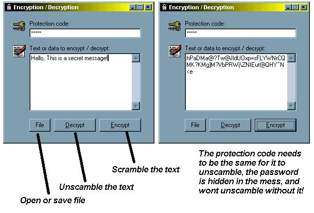



## Password Protected Encryption

### Description

Password protect files or text with this encryption program that will not unscamble the text unless the same password is given! Details in sreenshot.
 
### More Info
 

             |
---                |---
**Submitted On**   |2001-08-21 18:36:14
**By**             |[Chris Wilson UK](https://github.com/Planet-Source-Code/PSCIndex/blob/master/ByAuthor/chris-wilson-uk.md)
**Level**          |Intermediate
**User Rating**    |3.8 (15 globes from 4 users)
**Compatibility**  |VB 6\.0
**Category**       |[Complete Applications](https://github.com/Planet-Source-Code/PSCIndex/blob/master/ByCategory/complete-applications__1-27.md)
**World**          |[Visual Basic](https://github.com/Planet-Source-Code/PSCIndex/blob/master/ByWorld/visual-basic.md)
**Archive File**   |[Password P250608212001\.zip](https://github.com/Planet-Source-Code/chris-wilson-uk-password-protected-encryption__1-26450/archive/master.zip)

